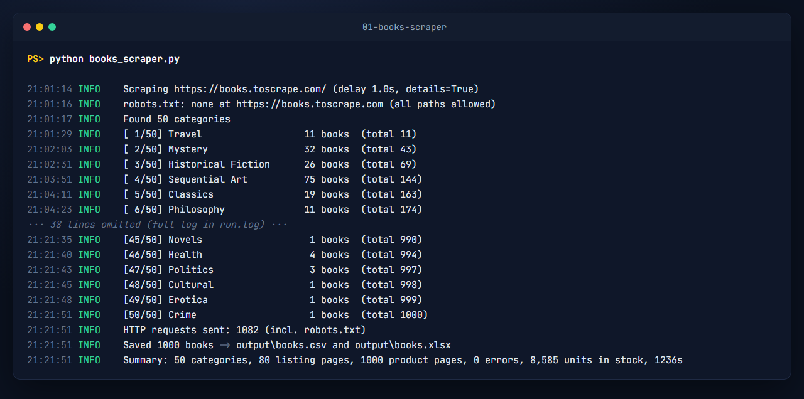
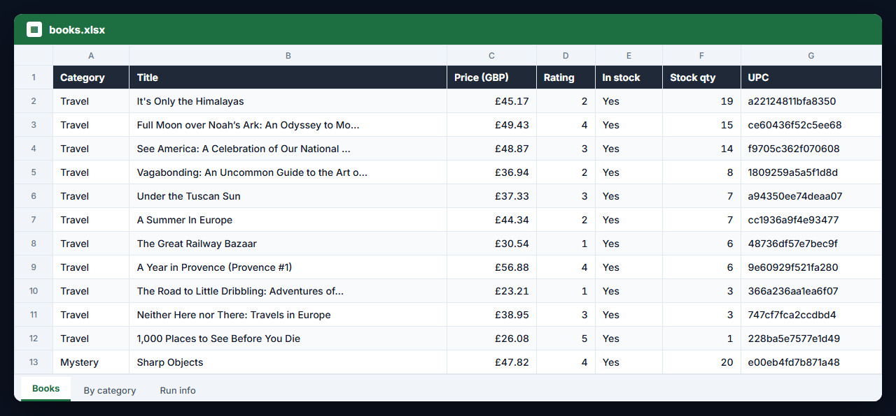

# E-commerce scraper: every product, price and stock level → CSV + Excel

Scrapes **books.toscrape.com**, a sandbox shop built for scraping practice. It walks all 50 categories and every page in each, opens each product page for the exact stock count and UPC, then writes:

| File | What's in it |
|---|---|
| `output/books.csv` | 1 row per product: category, title, price, rating (1–5), in stock, stock qty, UPC, reviews, product URL, image URL, timestamp. UTF-8 with BOM so Excel shows `£` correctly. |
| `output/books.xlsx` | **Books** (formatted table, £ prices, filters, frozen header) · **By category** (books, average/min/max price, average rating, units and stock value per category) · **Run info** |
| `output/run.log` | Full log of the run |




## Real run (2026-09-26, default settings)

- **1,000 products** from **50 categories**: 80 listing pages + 1,000 product pages, 1,082 requests including robots.txt
- **0 errors**, exit code 0, 20.6 minutes at 1 request per second
- 1,000 unique UPCs, no missing stock values; 8,585 units in stock; prices £10.00–£59.99
- The site's own category names are kept as-is (it really has categories called "Default" and "Add a comment")

An earlier full run hit a real one-minute DNS outage on this machine: urllib3 retries alone couldn't cover it, and 7 product pages failed. That's why the script now has a **second pass** that re-tries every failed page after a pause (tested in `tests/test_parsing.py`), and why failures are reported in the summary and the exit code instead of silently leaving blanks.

## Setup

Python 3.10 or newer.

```bash
python -m venv .venv
.venv\Scripts\activate            # macOS/Linux: source .venv/bin/activate
pip install -r requirements.txt
```

## Run

```bash
python books_scraper.py                                  # everything (~21 min at the polite default)
python books_scraper.py --no-details                     # listing pages only: ~80 requests, ~2 min, no stock qty/UPC
python books_scraper.py --categories "Travel,Poetry"     # just some categories
python books_scraper.py --list-categories
python books_scraper.py --config config.example.toml     # settings from a file (CLI flags win)
python books_scraper.py -v                               # log every request
python books_scraper.py --help
```

| Option | Default | Meaning |
|---|---|---|
| `--categories` | all | comma-separated category names |
| `--max-pages` | all | listing pages per category |
| `--details` / `--no-details` | details on | open product pages for stock qty, UPC, reviews |
| `--delay` | 1.0 | seconds between requests (minimum 0.5, enforced) |
| `--retries` | 4 | retries per request on 429/5xx/network errors, exponential backoff, honours `Retry-After` |
| `--retry-pause` | 30 | pause before the second pass over failed pages |
| `--timeout` | 20 | seconds per request |
| `--user-agent` | honest bot name | sent with every request |
| `--out-dir` | `output` | where files go |
| `--log-file` | `<out-dir>/run.log` | log file |

Exit codes: `0` success · `1` could not start (e.g. no network) · `2` bad option/config · `3` blocked by robots.txt · `4` finished but some pages failed twice (their rows have empty stock/UPC; re-run to fill them).

Ctrl+C saves everything scraped so far.

## How it's built

- `books_scraper.py`: parsing (pure functions, tested offline), crawling, second pass, CSV/Excel output, CLI.
- `core/http.py`: `PoliteSession` with retries/backoff, rate limiting, robots.txt checks (RFC 9309, including wildcards) and one-line retry logging.
- `core/excel.py`: formatted tables and summary sheets with openpyxl.
- `core/log.py`, `core/config.py`: logging and TOML config.

## Tests

`python -m pytest -q` → 14 passed, no network needed: category/listing/detail parsing, next-page links, price parsing, CSV + Excel output, the delay floor, second-pass recovery of failed listing and product pages, and `core/http.py` against a local test server (retries after 503s, robots.txt blocking, HTTP errors, rate limiting, wildcard rules).

## Notes

- books.toscrape.com exists for scraping practice and has no robots.txt (the script checks and logs this). For a real shop, check its terms and robots.txt first; the script stops with exit code 3 if robots.txt disallows a page.
- Built with an AI-assisted workflow, then run and tested as described above.
