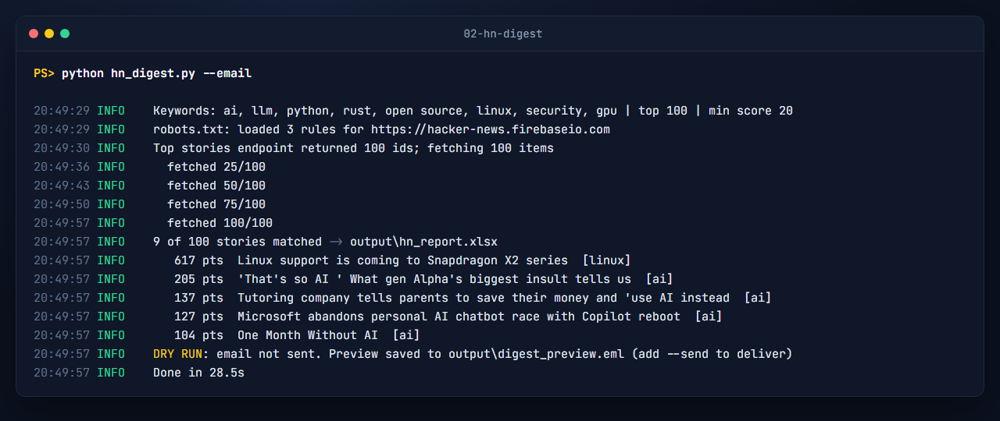

# Hacker News keyword digest: API → Excel/CSV (Google-Sheets-ready) + email

Checks the current Hacker News top stories through the **official public API**, keeps the ones whose title or domain mentions your keywords, and produces:

| File | What's in it |
|---|---|
| `output/hn_report.xlsx` | **Matches** (sorted by score), **Keyword summary** (stories, average score and top story per keyword), **All top stories**, **Run info** |
| `output/hn_matches.csv`, `output/hn_top_stories.csv` | UTF-8, ISO dates, one header row: upload straight into Google Sheets (File → Import) |
| `output/digest_preview.html`, `digest_preview.eml` | The email digest (HTML + plain text) exactly as it would be sent |
| `output/run.log` | Log of the run |

Optional: `--sheet-id` writes the matches straight into a Google Sheet tab (service account), and `--email --send` sends the digest over SMTP. **Email is a dry run by default**: nothing is sent unless you add `--send`.



## Setup

Python 3.10 or newer.

```bash
python -m venv .venv
.venv\Scripts\activate            # macOS/Linux: source .venv/bin/activate
pip install -r requirements.txt
```

## Run

```bash
python hn_digest.py                                    # settings from config.toml
python hn_digest.py --keywords "python,rust" --top 200 --min-score 50
python hn_digest.py --email                            # build the digest, DRY RUN
python hn_digest.py --email --send                     # really send (needs .env, below)
python hn_digest.py --sheet-id 1AbC...xyz              # also update a Google Sheet
python hn_digest.py --help
```

## Settings

`config.toml` (no secrets):

| Key | Meaning | Sample value |
|---|---|---|
| `keywords` | words/phrases to match in titles and domains; whole words, case-insensitive (`ai` matches "AI agents", not "said") | `["ai", "llm", "python", …]` |
| `top` | how many top stories to check (max 500) | `100` |
| `min_score` | ignore stories below this score | `20` |
| `out_dir` | output folder | `output` |
| `delay` | seconds between API calls | `0.1` |

Secrets go in `.env` (copy `.env.example` to `.env`; it is never delivered or committed):

| Variable | Used for |
|---|---|
| `SMTP_HOST`, `SMTP_PORT`, `SMTP_SECURITY` (`starttls`/`ssl`/`none`), `SMTP_USER`, `SMTP_PASSWORD` | sending the digest. Gmail: `smtp.gmail.com`, `587`, `starttls` and an App Password |
| `DIGEST_FROM`, `DIGEST_TO` | sender and comma-separated recipients |
| `GOOGLE_SERVICE_ACCOUNT_FILE` | path to a Google service-account JSON key for `--sheet-id`. Share the sheet with the service account's address first |

## Run it every morning

Windows Task Scheduler → *Create Basic Task* → Daily → *Start a program*: `C:\path\to\.venv\Scripts\python.exe`, arguments `hn_digest.py --email --send`, *Start in*: this folder.
cron (macOS/Linux): `0 7 * * * cd /path/to/02-hn-digest && .venv/bin/python hn_digest.py --email --send`

## How it was tested

- **Real run** on 2026-09-26: 100 top stories checked in 28.5 s, 9 matched (`output/terminal.txt`, `output/hn_report.xlsx`).
- **Email:** sent for real to a local SMTP test server (`python -m smtpd -n -c DebuggingServer 127.0.0.1:8025` with `SMTP_SECURITY=none`), accepted without errors. The unit tests also deliver to an in-process SMTP server. A missing `SMTP_HOST` gives a clear error.
- **Google Sheets:** the upload code is tested against a fake gspread client (creates the tab, clears it, writes header + rows). It has **not** been run against a live Google account for this sample, because that needs a buyer's own service-account key.
- `python -m pytest -q` → 13 passed (filtering, outputs, email, Sheets push, argument errors, HTTP retries/robots.txt).

## Notes

- robots.txt: the API's robots.txt only allows `*.json` paths using wildcards, which Python's built-in `urllib.robotparser` misreads as "disallow everything". `core/http.py` implements RFC 9309 matching, so the script checks the rules properly instead of switching them off.
- Only public story data is collected (titles, links, scores, comment counts); no usernames or other personal data.
- Built with an AI-assisted workflow, then run and tested as described above.
