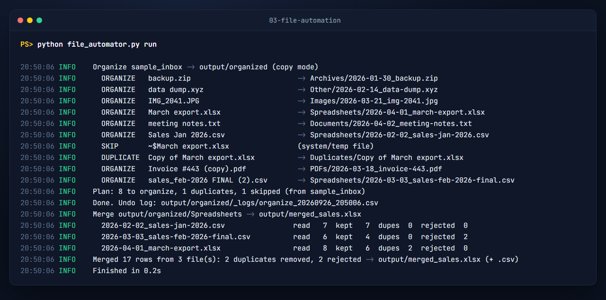

# File automation: organise a messy folder, merge CSV/Excel exports into one clean workbook

One script, four commands:

| Command | What it does |
|---|---|
| `organize` | Sorts files into folders by type (Spreadsheets, PDFs, Images, Documents, Archives, Other) and renames them `YYYY-MM-DD_clean-name.ext`. Byte-identical files go to `Duplicates/`; Excel lock files and system files are skipped. **Dry run by default.** Every real run writes an undo log. |
| `merge` | Reads every `.csv` / `.xlsx` in a folder and produces one cleaned workbook: **Summary**, **Data**, **Rejected** (with the reason per row), **Duplicates removed**, plus a `.csv` copy. |
| `run` | `organize` (for real) + `merge`, driven by `config.toml`. This is what the scheduler calls. A lock file stops two runs overlapping. |
| `undo <log>` | Reverses an organize run (moves files back, or removes the copies it made, as long as they're unchanged). |



## What "cleaned" means here

The demo inbox (`make_sample_inbox.py`, fictional data) contains the usual real-world mess, and the merge handles all of it:

- Different header names for the same thing (`Order ID` / `Order No` / `order #`), mapped through aliases in `config.toml`
- A header row sitting under title rows in an Excel export
- Semicolon-delimited, cp1252-encoded CSV from a European system (`1.990,00`, `15/02/2026`, `Café`)
- Money stored as text (`$1,250.00`), stray spaces, inconsistent case (`south `, `WEST`)
- Blank rows, orders repeated across monthly files (deduplicated on `order_id`)
- Invalid rows (empty amount, impossible date `31/02/2026`), moved to **Rejected** with the reason instead of silently dropped

Demo result (`output/merged_sales.xlsx`): 3 files, 21 rows read → **17 kept**, 2 duplicates removed, 2 rejected, total amount 8,889.00, with totals by region and by product on the Summary sheet.

## Setup

Python 3.10 or newer. Only one dependency (openpyxl).

```bash
python -m venv .venv
.venv\Scripts\activate            # macOS/Linux: source .venv/bin/activate
pip install -r requirements.txt
python make_sample_inbox.py       # optional: recreate the demo inbox
```

## Run

```bash
python file_automator.py organize                 # preview: shows every rename/move, changes nothing
python file_automator.py organize --apply         # do it (copy mode by default)
python file_automator.py organize --apply --mode move
python file_automator.py merge                    # merge using config.toml
python file_automator.py merge --source "D:/exports/2026" --output "D:/reports/all_sales.xlsx"
python file_automator.py run                      # organize + merge (scheduled job)
python file_automator.py undo output/organized/_logs/organize_20260926_205006.csv
```

Exit codes: `0` OK, `1` output file locked (e.g. open in Excel; unreadable input files are skipped and listed on the Summary sheet instead), `2` config problem (missing folder, bad TOML, run already in progress).

## Settings (`config.toml`)

- `[organize]`: `inbox`, `dest`, `mode` (`copy`/`move`), `rename` pattern (`{date}`, `{slug}`, `{name}`, `{ext}`), `date_source` (`modified`/`today`), and `[organize.folders]` (extension lists per folder).
- `[merge]`: `source`, `output`, `dedupe_on`, `header_search_rows`, `date_formats`, `title_case`.
- `[merge.columns]`: the output schema. Each column has a `type` (`text`, `int`, `number`, `date`), optional `required = true`, and `aliases` that source headers are matched against (case, spaces and punctuation ignored).
- `[merge.summary]`: which column to total (`sum`) and which columns to group by (`group_by`).

Relative paths are relative to the config file, so the folder can be moved anywhere.

## Run it on a schedule

**Windows Task Scheduler.** `schedule\run_scheduled.bat` changes to the project folder, uses `.venv` if present and appends output to `logs\scheduled.log`.

- Point and click: Task Scheduler → *Create Basic Task* → name it → *Daily* (or *Weekly*) → *Start a program* → browse to `schedule\run_scheduled.bat` → Finish. Tick "Run whether user is logged on or not" in the task's properties if needed.
- Or from Command Prompt (use your real path):
  ```bat
  schtasks /Create /TN "File automation" /SC DAILY /ST 07:00 /TR "\"C:\path\to\03-file-automation\schedule\run_scheduled.bat\""
  ```
  Check it with `schtasks /Query /TN "File automation"`, run it now with `schtasks /Run /TN "File automation"`, remove it with `schtasks /Delete /TN "File automation" /F`.

**cron (macOS/Linux):**
```bash
chmod +x schedule/run_scheduled.sh
crontab -e
# every day at 07:00
0 7 * * * /path/to/03-file-automation/schedule/run_scheduled.sh
```

## How it was tested

- Real run on the demo inbox: `output/terminal.txt`, `output/organized/`, `output/merged_sales.xlsx`.
- `schedule\run_scheduled.bat` run through `cmd` (exit 0, log written); `run_scheduled.sh` run through `sh` (exit 0). No task was registered on the build machine.
- `python -m pytest -q` → 20 passed: number/date/slug parsing, dry run changes nothing, full run (17 rows, cleaned regions, cp1252 decoding, rejected reasons), **second run changes nothing**, undo, move mode, config errors, the run lock.
- Built with an AI-assisted workflow, then run and tested as described above.
